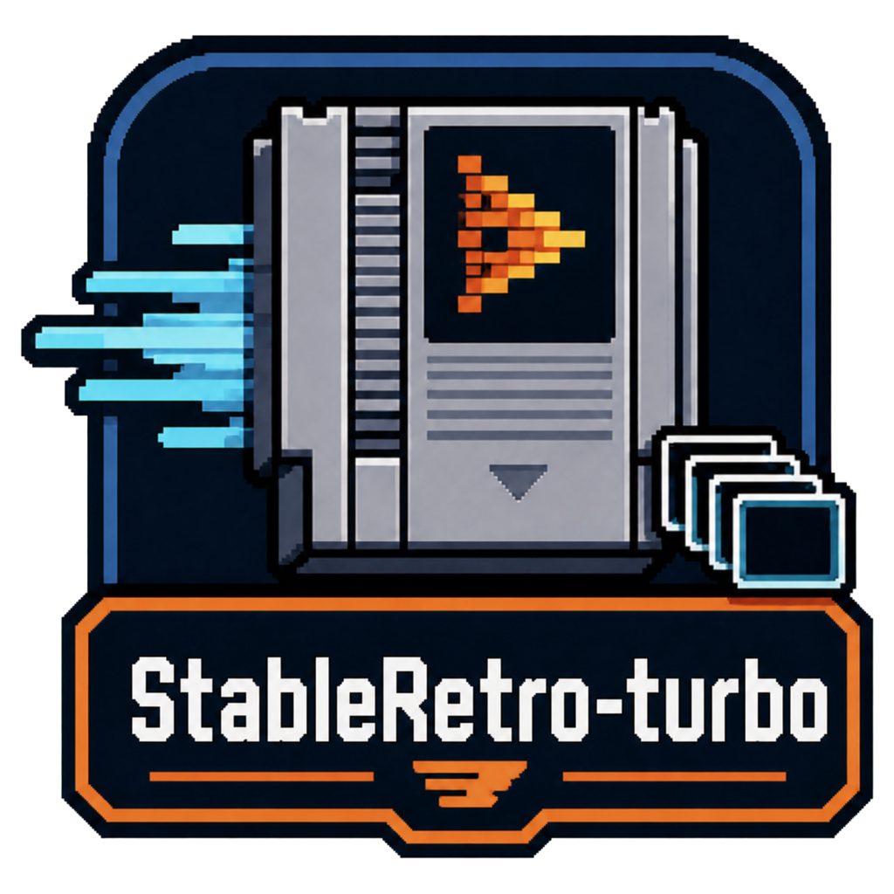
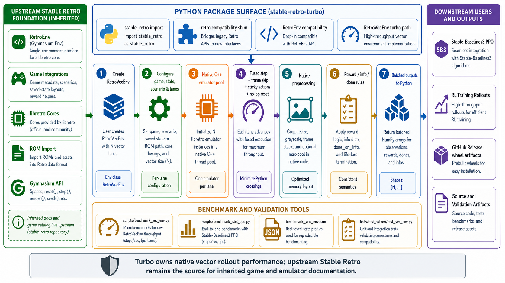

<div align="center">
  

  **🎮 Working Apple Silicon builds for stable-retro 🍎**
</div>

`stable-retro-apple-silicon` publishes installable macOS Apple Silicon wheels for the upstream [`stable-retro`](https://github.com/Farama-Foundation/stable-retro) API surface.

Use it when you want `stable_retro` game environments on an M-series Mac without building the package and bundled public libretro cores from source yourself.

## Install

```bash
python -m pip install stable-retro-apple-silicon
```

Use it from Python:

```python
import stable_retro as retro

env = retro.make("Alleyway-GameBoy-v0", render_mode="rgb_array")
```

## RL preprocessing and SB3

For reinforcement-learning loops, image preprocessing can be done inside each
environment worker before observations are returned to the caller. This is useful
with `SubprocVecEnv`, where sending smaller observations across process
boundaries can be much faster than returning full-size RGB frames and resizing
later.

```python
import stable_retro as retro

env = retro.make(
    "SuperMarioBros-Nes-v0",
    render_mode="rgb_array",
    obs_resize=(84, 84),
    obs_resize_algorithm="nearest",  # nearest, bilinear, or area
    obs_grayscale=True,
)
```

Available image kwargs:

- `obs_resize=(height, width)`: resize image observations before they leave the env.
- `obs_resize_algorithm="nearest"`: choose `nearest`, `bilinear`, or `area`; `nearest` is fastest, while `area` is downscale-only and does more averaging work.
- `obs_grayscale=True`: return grayscale observations with shape `(height, width, 1)`.
- `obs_crop=(top, bottom, left, right)`: crop pixels before grayscale and resize.

Pass the same options through Stable-Baselines3 with `env_kwargs`:

```python
from stable_baselines3.common.env_util import make_vec_env
from stable_baselines3.common.vec_env import SubprocVecEnv, VecTransposeImage


def make_mario_env(**kwargs):
    return retro.make(
        "SuperMarioBros-Nes-v0",
        render_mode="rgb_array",
        **kwargs,
    )


env = make_vec_env(
    make_mario_env,
    n_envs=8,
    vec_env_cls=SubprocVecEnv,
    vec_env_kwargs={"start_method": "spawn"},
    env_kwargs={
        "obs_resize": (84, 84),
        "obs_resize_algorithm": "nearest",
        "obs_grayscale": True,
    },
)
env = VecTransposeImage(env)  # (n_envs, 1, 84, 84) for grayscale
```

If your agent does not use audio, set `STABLE_RETRO_DISABLE_AUDIO=1` before
creating environments. This keeps RGB observations enabled while skipping audio
capture and supported core-side audio generation.

The deprecated compatibility import still works:

```python
import retro
```

For local development:

```bash
git clone https://github.com/tsilva/stable-retro-apple-silicon.git
cd stable-retro-apple-silicon
brew install cmake pkg-config lua@5.4 libzip
python -m pip install -U pip build cibuildwheel pytest pre-commit
python -m pip install -e .
```

## Commands

```bash
python -m pip install stable-retro-apple-silicon  # install the published package
python -m pip install -e .                        # build and install this checkout
python -m build --wheel                           # build a local wheel
python -m cibuildwheel . --output-dir wheelhouse  # build release-style macOS arm64 wheels
pytest                                            # run Python tests
pre-commit run --all-files                        # run repository hooks
cmake . && make -j2 && make -j2 -f tests/Makefile && ctest --progress --verbose
```

## Notes

- Published wheels target Apple Silicon `arm64`, macOS `14.0+`, and Python `3.9` through `3.12`.
- The public wheel build includes Game Boy, NES, SNES, and Sega Master System cores: `gambatte`, `fceumm`, `snes9x`, and `genesis_plus_gx`.
- CapnProto is disabled in the public wheel build path.
- SNES on Apple Silicon uses an automatic Rosetta helper because the native arm64 `snes9x` path is not stable across the bundled integrations.
- If Rosetta is not installed yet, install it once:

```bash
softwareupdate --install-rosetta --agree-to-license
```

- Release automation builds macOS arm64 wheels, publishes them to PyPI, and attaches matching wheel files to GitHub Releases.
- See [`PUBLISHING.md`](PUBLISHING.md) for the release checklist.
- Upstream API and integration docs are still useful: [`docs/supported_emulators.md`](docs/supported_emulators.md), [`docs/supported_games.md`](docs/supported_games.md), and [`docs/macos_installation.md`](docs/macos_installation.md).

## Architecture



## License

[MIT](LICENSE). Bundled third-party notices are listed in [`LICENSES.md`](LICENSES.md).
